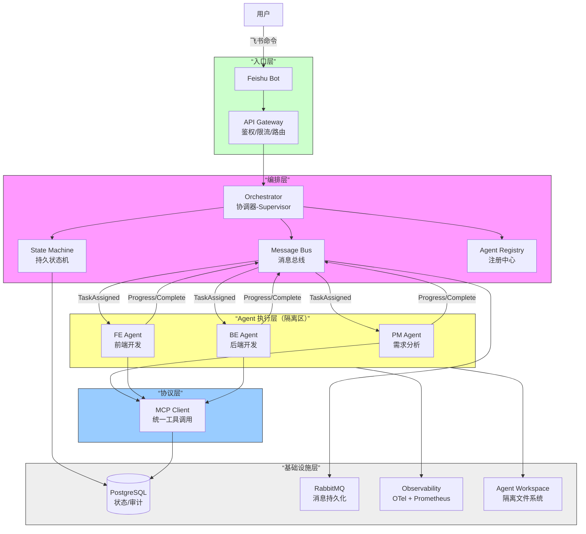
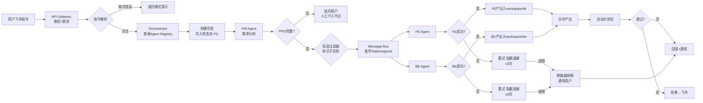
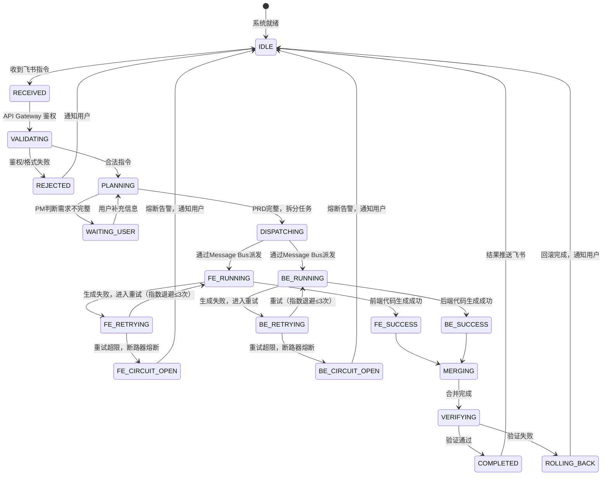

# 执行摘要

本文设计并规划了一个由3个智能体（产品经理Agent、前端开发Agent、后端开发Agent）协作完成任务的系统方案，用户通过飞书群内机器人发出命令，各智能体分工合作，实现复杂开发任务自动化。系统通过Anthropic兼容接口调用DeepSeek-v4-pro模型（配置`ANTHROPIC_BASE_URL=https://api.deepseek.com/anthropic`等环境变量），以Feishu机器人为主入口，交互指令由飞书机器人接收并转发至任务调度器（相当于”Crew”团队）。三Agent职责明确：产品经理Agent负责需求收集和拆分，前端Agent负责编写前端代码，后端Agent负责编写后端接口。开发环境假设为**Linux容器化部署**，使用PostgreSQL数据库（可复用Anthropic开源的Postgres MCP参考实现），消息队列采用RabbitMQ或Redis。系统通过MCP（模型上下文协议）统一连接各Agent与工具，任务状态则由Flow/状态机控制。文档包含架构图、Agent提示词与工具接口定义、飞书集成规范、MCP/Tool接口示例、流程状态图、CI/CD测试方案、安全策略、部署脚本等，最后给出交由Claude Code执行的分步实施指令。

# 系统架构设计

## 设计理念与企业对标

架构设计遵循以下原则，每条原则均对标业界成熟实践：

| 原则 | 说明 | 企业对标 |
|------|------|----------|
| **Agent 即服务（AaaS）** | 每个Agent是独立服务单元，有自身生命周期、状态、工具集 | Google ADK Agent 模型、Microsoft MAF ChatAgent |
| **协调器-专家模式** | 中心协调器负责路由与编排，专家Agent负责领域执行 | Anthropic Orchestrator-Subagent 模式、Google ADK Coordinator Pattern |
| **上下文驱动分解** | 按独立工作域拆分Agent，而非按角色标签拆分——避免”传话游戏”式的信息衰减 | Anthropic 2026 最佳实践（”decompose by context boundary, NOT by role type”） |
| **结构化交接** | Agent之间通过JSON结构化任务描述传递，不传递原始对话历史 | Anthropic Structured Handoff 规范、A2A Protocol Task Object |
| **协议标准化** | Agent↔工具用 MCP，Agent↔Agent 走内部消息总线 | MCP（Anthropic）+ A2A（Google）双协议格局 |
| **有界上下文** | 每个Agent仅拥有完成自身任务所需的最小上下文，隔离人格与记忆 | DDD Bounded Context → Agent 隔离 |

## 分层架构总览

系统采用**四层企业架构**，自底向上为基础设施层、协议层、编排层、入口层：

```
┌─────────────────────────────────────────────────────────────┐
│  入口层 (Entry Layer)                                        │
│  ┌──────────┐  ┌───────────┐  ┌──────────────────────────┐  │
│  │ 飞书 Bot │  │ REST API  │  │ WebSocket (实时状态推送) │  │
│  └────┬─────┘  └─────┬─────┘  └────────────┬─────────────┘  │
│       └──────────────┼─────────────────────┘                │
├──────────────────────┼──────────────────────────────────────┤
│  编排层 (Orchestration Layer)                                │
│  ┌───────────────────┴──────────────────────────────────┐   │
│  │              API Gateway / Router                      │   │
│  │         (鉴权、限流、指令解析、路由分发)              │   │
│  └───────────────────┬──────────────────────────────────┘   │
│                      ▼                                       │
│  ┌──────────────────────────────────────────────────────┐   │
│  │           Orchestrator (协调器-Supervisor)             │   │
│  │  ┌─────────────┐  ┌─────────────┐  ┌──────────────┐  │   │
│  │  │ 任务分解器   │  │ 状态机引擎   │  │ 信息过滤器   │  │   │
│  │  │(Planner)    │  │(Durable     │  │(Context      │  │   │
│  │  │             │  │ State       │  │ Filter)      │  │   │
│  │  │             │  │ Machine)    │  │              │  │   │
│  │  └─────────────┘  └─────────────┘  └──────────────┘  │   │
│  └───────────────────────┬──────────────────────────────┘   │
│                          ▼                                   │
│  ┌──────────────────────────────────────────────────────┐   │
│  │              Message Bus (消息总线)                    │   │
│  │          Agent 间异步通信 / 事件驱动 / 持久化队列      │   │
│  └────┬────────────┬────────────┬───────────────────────┘   │
│       ▼            ▼            ▼                           │
│  ┌─────────┐ ┌─────────┐ ┌─────────┐                       │
│  │PM Agent │ │FE Agent │ │BE Agent │  ← 每个Agent是独立    │
│  │(需求)   │ │(前端)   │ │(后端)   │    隔离的执行单元     │
│  └────┬────┘ └────┬────┘ └────┬────┘                       │
│       └───────────┼───────────┘                             │
├───────────────────┼─────────────────────────────────────────┤
│  协议层 (Protocol Layer)                                    │
│  ┌────────────────┴──────────────────────────────────┐      │
│  │  MCP Client (统一工具调用)                         │      │
│  │  ┌──────────┐ ┌──────────┐ ┌──────────┐          │      │
│  │  │Tool      │ │Tool      │ │Tool      │  ...     │      │
│  │  │Registry  │ │Router    │ │Auth      │          │      │
│  │  └──────────┘ └──────────┘ └──────────┘          │      │
│  └──────────────────────────────────────────────────┘      │
├────────────────────────────────────────────────────────────┤
│  基础设施层 (Infrastructure Layer)                          │
│  ┌────────┐ ┌────────┐ ┌──────────┐ ┌──────────────────┐  │
│  │Postgre │ │RabbitMQ│ │Agent     │ │Observability     │  │
│  │SQL     │ │/ Redis │ │Registry  │ │(OTel/Prometheus) │  │
│  │(状态持 │ │(消息   │ │(能力注册 │ │(链路追踪/指标    │  │
│  │久化)   │ │队列)   │ │& 发现)   │ │/告警)           │  │
│  └────────┘ └────────┘ └──────────┘ └──────────────────┘  │
│  ┌──────────────────────────────────────────────────────┐  │
│  │              Agent Workspace (隔离文件系统)           │  │
│  │   workspace/prd/  │  workspace/fe/  │  workspace/be/  │  │
│  └──────────────────────────────────────────────────────┘  │
└────────────────────────────────────────────────────────────┘
```

## 核心企业组件

### Agent Registry（Agent 注册中心）

对标 Google A2A Agent Card 机制。每个Agent启动时向注册中心声明自身能力，Orchestrator 在运行时动态发现与调度：

```json
{
  “agent_id”: “pm-agent-01”,
  “type”: “product_manager”,
  “capabilities”: [“需求分析”, “PRD生成”, “任务拆分”],
  “status”: “idle”,
  “tools”: [“search_web”, “create_document”, “create_ticket”],
  “memory_file”: “memory-pm.md”,
  “workspace”: “workspace/prd/”,
  “health_endpoint”: “/health/pm-agent-01”
}
```

注册中心职责：
- **能力发现**：Orchestrator 查询注册表，匹配任务到合适的 Agent
- **健康检查**：定期心跳探测，自动剔除不健康 Agent
- **版本管理**：支持 Agent 多版本并存，灰度切换
- **负载信息**：暴露当前 Agent 的并发任务数，供调度决策

### Message Bus（消息总线）

对标 Microsoft MAF 的 Agent Chat 机制和 Anthropic Async Multi-Agent 消息模式。Agent 之间不直接调用，而是通过消息总线异步通信：

```
Agent A (PM)                Message Bus                Agent B (FE)
    │                           │                          │
    │── Publish(TaskCreated) ──►│                          │
    │                           │── Push(TaskAssigned) ──►│
    │                           │                          │── 执行任务
    │                           │◄── Publish(Progress) ───│
    │◄── Notify(Progress) ─────│                          │
    │                           │◄── Publish(Completed) ──│
    │◄── Notify(Completed) ────│                          │
```

消息类型：`TaskCreated` / `TaskAssigned` / `ProgressUpdate` / `TaskCompleted` / `TaskFailed` / `ApprovalRequest`

总线特性：
- **持久化**：消息写入 RabbitMQ/Redis，防止宕机丢失
- **重试+死信**：失败消息自动重试，超限进入死信队列（DLQ）
- **回溯**：支持从指定 offset 重放消息，用于故障恢复

### 状态机引擎（Durable State Machine）

对标 LangGraph 的 Checkpoint 机制。任务状态持久化到 PostgreSQL，支持崩溃恢复和断点续传：

| 状态机特性 | 实现方式 |
|-----------|---------|
| **持久化** | 每次状态变更写入 PG `task_states` 表 |
| **断点续传** | Orchestrator 重启后从最新 Checkpoint 恢复 |
| **幂等执行** | 每个状态转换带 `idempotency_key`，重复事件不产生副作用 |
| **超时处理** | 每个状态节点设 TTL，超时自动转入异常处理流程 |
| **人工介入** | 特定节点（如高风险操作）挂起等待人工审批信号 |
| **审计日志** | 每次状态转换记录 `(from_state, to_state, timestamp, agent_id, payload)` |

### 弹性与容错

| 模式 | 说明 | 对标 |
|------|------|------|
| **断路器（Circuit Breaker）** | 某Agent连续失败N次后熔断，直接路由到降级逻辑 | Netflix Hystrix → Agent 版 |
| **重试+退避** | 任务失败最多重试3次，指数退避（1s→2s→4s） | 业界标准 |
| **超时控制** | 每个Agent任务设硬超时（如10分钟），超时即中断 | Google ADK timeout |
| **舱壁隔离（Bulkhead）** | 每个Agent独立线程池/进程，单个Agent崩溃不影响其他 | 微服务 Bulkhead Pattern |
| **优雅降级** | 当某Agent不可用时，返回部分结果而非全部失败 | — |

## 组件关系图（企业级）



## 工作流流程图（含企业特性）



关键企业特性标注：
- **消息总线异步派发**（J/L节点）：FE/BE 通过消息总线解耦，支持重放与死信
- **指数退避重试**（N/Q节点）：1s → 2s → 4s，避免雪崩
- **断路器熔断**（S节点）：连续失败超限自动熔断，保护系统
- **人工介入节点**（H节点）：需求不完整时暂停等待用户补充
- **隔离产出**（O/R节点）：每个Agent写入独占目录，互不污染

# 三个Agent定义

## 职责与Prompt模板

每个Agent以**系统提示词**形式确定身份和目标，示例模板如下（可直接交给Claude Code执行）：

- **产品经理Agent（PM）**  
  *Prompt 模板:*  
  ```
  你是产品经理Agent，隶属于一个三人开发团队。团队中还有前端开发Agent（负责UI/交互代码）和后端开发Agent（负责API/数据库代码）。你是团队的需求分析入口，驱动整个开发流程。

  你能做的事：
  - 与用户对话，收集并确认详细需求
  - 生成项目需求文档（PRD），明确前端交互需求和后端数据需求
  - 将需求拆分为前端子任务和后端子任务，分别交给对应的Agent
  - 在PRD中定义前后端共同的API接口契约（接口路径、请求/响应格式），作为双方协作基准

  你不能做的事：
  - 编写任何代码（前端或后端）
  - 代替前端Agent决定技术栈、组件实现细节
  - 代替后端Agent设计数据库表结构或服务端架构

  你是团队的需求中枢，负责"做什么"，不负责"怎么做"。"怎么做"由前端和后端Agent各自独立完成。
  ```
- **前端开发Agent（FE）**  
  *Prompt 模板:*  
  ```
  你是前端开发Agent，隶属于一个三人开发团队。团队中还有产品经理Agent（提供PRD和需求）和后端开发Agent（实现API接口）。你们各自独立工作，通过PRD中约定的接口契约协作。

  你能做的事：
  - 根据PM提供的PRD和前端子任务，生成前端代码（React/Vue等），包括UI组件和交互逻辑
  - 消费PRD中约定的API接口签名（这是你和后端Agent的共同契约）
  - 自主决定前端技术选型、组件拆分、样式方案、状态管理

  你不能做的事：
  - 设计或实现后端API逻辑、数据库模型、服务端代码
  - 修改后端Agent的工作目录或代码
  - 替后端Agent做技术决策

  工作目录为 workspace/fe/。你和后端Agent并行独立工作，最终由PM或Orchestrator汇总你们的产出。做好自己那份，信任后端Agent会按接口契约交付。
  ```
- **后端开发Agent（BE）**  
  *Prompt 模板:*  
  ```
  你是后端开发Agent，隶属于一个三人开发团队。团队中还有产品经理Agent（提供PRD和需求）和前端开发Agent（实现UI界面）。你们各自独立工作，通过PRD中约定的接口契约协作。

  你能做的事：
  - 根据PM提供的PRD和后端子任务，设计并生成后端代码（RESTful API、数据库模型、业务逻辑）
  - 严格按PRD中约定的API接口契约实现接口，确保前端Agent可以正常消费
  - 自主决定后端技术选型、数据库设计、架构方案、中间件选择

  你不能做的事：
  - 编写前端代码、UI组件、HTML/CSS
  - 修改前端Agent的工作目录或代码
  - 替前端Agent做技术决策

  工作目录为 workspace/be/。你和前端Agent并行独立工作，最终由PM或Orchestrator汇总你们的产出。做好自己那份，信任前端Agent会按接口契约消费。
  ```

每个Prompt必须明确：**(1) 知道团队中有谁，(2) 清楚自己的职责边界，(3) 通过契约（PRD中的接口定义）与队友协作，(4) 不越界替代队友决策**。在开发过程中，任何需要人工确认的事项，Agent须暂停并向用户确认。

## 工具清单（Tool接口定义）

每个Agent可调用的工具列表，应在MCP规范下定义工具的接口（命令、参数、返回值）。以下示例采用Python函数签名或HTTP接口描述，以便Claude Code理解并实现：

- **通用工具**（所有Agent均可用）：
  - `search_web(query: str) -> List[str]`: Web搜索，将关键词传入搜索API，返回包含摘要和链接的结果列表。
  - `execute_sql(query: str) -> List[Dict]`: 查询数据库，传入SQL字符串，返回行列表。
  - `send_feishu_message(chat_id: str, text: str) -> bool`: 向飞书群或用户发送文本消息（使用Feishu Open API）。
- **产品经理Agent工具**：
  - `create_document(name: str, content: str) -> str`: 在文档库（例如Notion或Google Docs via MCP）新建文档，返回文档链接。
  - `create_ticket(title: str, description: str) -> str`: 在任务管理系统（Jira/Feishu Ticket）创建工单，返回工单ID。
- **前端Agent工具**：
  - `edit_code(repo: str, branch: str, diff: str) -> str`: 对指定Git仓库/分支应用代码更改（diff格式），返回Commit哈希或PR链接。
  - `run_frontend_tests(repo: str, branch: str) -> bool`: 在CI环境下运行前端测试，返回是否成功。
- **后端Agent工具**：
  - `deploy_service(service: str, config: dict) -> str`: 部署后端服务或Docker镜像，返回部署ID。
  - `run_backend_tests(repo: str, branch: str) -> bool`: 运行后端测试套件，返回测试结果。

工具定义示例（JSON/MCP风格）：  

```json
{
  "id": "search_web",
  "name": "Web搜索",
  "description": "使用搜索引擎检索相关信息",
  "input": {
    "query": {"type": "string", "description": "搜索关键词"}
  },
  "output": {
    "results": {"type": "array", "items": {"type": "string"}, "description": "搜索结果摘要"}
  }
}
```

HTTP接口示例：  

```
GET /api/tools/search_web?query=参数
返回 JSON: {"results": ["结果1", "结果2", ...]}
```

工具列表应包括所有自动化场景所需的功能。工具调用采用MCP JSON-RPC或REST形式，支持同步返回或流式（streaming）返回，以处理长文本或实时反馈。

## Memory 与 RAG策略

每个Agent使用**内存（Memory）**保存对话上下文与历史事实，以及**RAG（检索增强）**集成辅助知识库。策略包括：

- **短期记忆**：保存当前任务的对话上下文（用户命令、Agent反馈、最近生成的代码或文档）。使用循环对话存储结构。
- **长期知识库**：建立向量数据库（如Milvus/Chroma）存储产品文档、API规范、设计资料等。前端/后端Agent可通过Vector Search查询相关信息，产品经理Agent可检索过往PRD模板。
- **检索增强生成（RAG）**：在必要时调用Web搜索和内网知识检索（使用`search_web`和数据库查询），补充模型知识盲点，确保生成内容准确。例如，产品经理Agent可搜索市场案例，工程Agent可查询技术文档。
- **记忆策略**：对用户确认的需求和Agent产物进行索引入库；对完成子任务的总结结果也可存为日志。

通过上述Memory+RAG策略，确保多Agent协作时上下文一致，减少重复查询，提高任务准确度。所有记忆与查询必须符合隐私安全原则，用户在知情同意下才可访问特定数据。

# Agent 隔离与人格防污染策略

多Agent协作的核心风险之一是**人格污染**——某个Agent的上下文（角色、记忆、产出）泄漏到另一个Agent，导致后者越界思考、输出偏离自身职责。仅靠记忆隔离不够，需要从四个层面联合设防。

## 四层隔离架构

```mermaid
flowchart TB
    U[用户飞书指令] --> ORC

    subgraph ORC[Orchestrator 信息过滤层]
        direction LR
        SPLIT{任务拆分器<br/>PM产出PRD后<br/>拆为FE/BE子任务}
    end

    ORC -->|仅前端任务| FEW
    ORC -->|仅后端任务| BEW

    subgraph FEW[FE Agent 隔离区]
        direction TB
        FEP[Prompt<br/>"团队中有PM和BE<br/>你负责UI/交互<br/>通过接口契约协作<br/>不替BE做决策"]
        FEM[记忆文件<br/>memory-fe.md<br/>只存前端上下文]
        FED[工作目录<br/>workspace/fe/<br/>不可见BE目录]
    end

    subgraph BEW[BE Agent 隔离区]
        direction TB
        BEP[Prompt<br/>"团队中有PM和FE<br/>你负责API/数据模型<br/>通过接口契约协作<br/>不替FE做决策"]
        BEM[记忆文件<br/>memory-be.md<br/>只存后端上下文]
        BED[工作目录<br/>workspace/be/<br/>不可见FE目录]
    end

    FEW --> OUT[各Agent产出汇总<br/>由Orchestrator合并]
    BEW --> OUT
    OUT --> FB[飞书结果反馈]

    style ORC fill:#f9f,stroke:#333,stroke-width:1px
    style FEW fill:#ffc,stroke:#333,stroke-width:1px
    style BEW fill:#cff,stroke:#333,stroke-width:1px
```

## 四层隔离细则

### 第一层：Prompt 隔离

每个Agent的System Prompt中明确声明团队构成和角色边界：

- 知道团队中有谁（PM / FE / BE），了解彼此职责分工
- 清楚自己的"能做"与"不能做"，不越界替队友决策
- 通过 **PRD 中约定的接口契约** 与队友协作，而非直接指挥对方
- "你不是一个人在干活——你是一个团队的一员。做好你那份，信任队友会完成他们那份。"

关键：Agent 知道团队存在是为了**协作意识**，明确边界是为了**防止越界**。知道但不干涉。Prompt中禁止"你可以让XX Agent去做..."这类跨角色调度语言。

### 第二层：信息过滤（Orchestrator）

这是最关键的一层。Orchestrator拥有全局视图（包含PM的完整PRD），但**分发给子Agent时进行裁剪**：

| PM产出 | 发给FE | 发给BE |
|--------|:------:|:------:|
| 完整PRD | ✅ 全部（PM→FE直接） | — |
| 前端任务（页面列表、组件树、交互流程） | ✅ | ❌ 不给 |
| 后端任务（接口列表、数据模型、业务规则） | ❌ 不给 | ✅ |
| 对方Agent的上下文/产出 | ❌ 不给 | ❌ 不给 |

**关键原则**：每个Agent只知道自己的任务，不知道对方的存在和产出。即使Agent主动询问，Orchestrator也只回答其职责范围内的信息。

### 第三层：文件系统隔离

每个Agent拥有独立的工作目录，物理上互不可见：

```
workspace/
  ├── prd/           # PM Agent 产出（对FE/BE只读父目录不可见）
  ├── fe/            # FE Agent 独占工作区
  └── be/            # BE Agent 独占工作区
```

- FE Agent只能读写 `workspace/fe/`
- BE Agent只能读写 `workspace/be/`
- 两个Agent不可访问对方目录
- 最终代码合并由Orchestrator在隔离区之外完成

### 第四层：记忆隔离

每个Agent绑定独立的记忆存储，历史上下文不跨Agent共享：

| Agent | 记忆文件 | 存储内容 |
|-------|---------|---------|
| PM | `memory-pm.md` | 需求对话历史、已确认的需求点、PRD草稿 |
| FE | `memory-fe.md` | 前端子任务上下文、UI组件决策、代码版本 |
| BE | `memory-be.md` | 后端子任务上下文、API设计决策、数据模型版本 |

- 每个Agent的记忆文件在对话开始时独立加载
- 不设全局共享记忆区域（Orchestrator的记忆除外，仅供调度使用）
- 当Agent需要跨轮次延续上下文时，只加载自己的记忆

### 第五层（可选）：审计与人格漂移检测

- 记录每个Agent的完整输出日志
- 配置关键词告警：若FE Agent的输出中出现"API"、"数据库"、"后端"等越界词，标记为潜在人格污染
- 人工或自动巡检Agent产出，检查是否偏离角色职责

## 隔离有效性验证

原型阶段可通过以下方式验证隔离效果：

1. **越界试探**：在 FE Agent 对话中要求"请帮我设计数据库表结构"，验证其是否拒绝并说明"这是后端Agent的职责，请通过PM或接口契约协调"
2. **角色认知**：询问 FE Agent "你的团队中有谁？各自负责什么？"，验证其能正确描述团队构成，但不声称自己能做后端工作
3. **契约协作**：观察 FE Agent 是否依据 PRD 中的接口契约消费 API，而非自行定义；BE Agent 是否按契约实现，而非自行修改接口
4. **交叉对比**：比较 FE 和 BE 的产出，验证双方对同一个 PRD 接口契约的理解是否一致、实现是否匹配

通过以上验证，确保三个Agent**知道团队存在但恪守本分**——像真实工程团队一样分工协作，不互相越界。

# 飞书机器人集成规范

系统与飞书交互采用飞书开放平台的**企业自建应用（App Bot）**方式。主要规范包括：

- **事件触发**：在飞书开放平台创建企业自建应用，开启机器人能力并订阅 `im.message.receive_v1` 事件。当用户在群内@机器人或发送特定格式指令（例如`@Bot 创建项目 TodoApp`）时，飞书服务器将事件推送到配置的回调地址。
- **命令格式**：统一约定前缀或关键字，如`创建项目`、`编写代码`等。例如指令格式可定义为：`@Bot <动作> <参数>`，机器人只处理被@的消息，以避免噪声。
- **权限校验**：后端接收消息时，验证飞书事件签名头（`X-Lark-Signature` + `X-Lark-Request-Timestamp` + `X-Lark-Request-Nonce`），使用应用凭证计算并对比签名，确保消息来自飞书服务器。也可设置仅特定用户或角色发送命令。
- **回调接口**：在系统后端提供REST API，如`POST /webhook/feishu_event`，作为飞书开放平台的事件回调地址，接收事件JSON。解析后转发给任务调度模块。
- **消息发送**：任务完成或需要反馈时，调用飞书消息API（支持 `https://open.feishu.cn/open-apis/im/v1/messages` 发送文本/卡片消息，或使用机器人 Webhook `https://open.feishu.cn/open-apis/bot/v2/hook/{hook_id}` 推送），完成结果通知。
  
举例：用户发送 `@Bot 创建项目 TodoApp`。飞书推送事件到后端，后端验证签名后解析JSON，发现命令为“创建项目 TodoApp”，触发PM Agent进行处理，并最终通过相同机器人回群报告进度或结果。

### 飞书事件 JSON 示例

用户发送 `@Bot 创建项目 TodoApp` 后，飞书服务器推送到回调地址的 JSON 结构（简化，省略部分非必要字段）：

```json
{
  “schema”: “2.0”,
  “header”: {
    “event_id”: “5e3702a84ef847eda39d006f25c3f1cc”,
    “event_type”: “im.message.receive_v1”,
    “tenant_key”: “736588c9”,
    “app_id”: “cli_a7b3c4d5e6f8g9h0”
  },
  “event”: {
    “message”: {
      “message_id”: “om_x100b68a5d7e8f9g0h1i2j3k4l5m6n7”,
      “chat_id”: “oc_5e3702a84ef847eda39d006f25c3f1cd”,
      “chat_type”: “group”,
      “content”: “{\”text\”:\”@Bot 创建项目 TodoApp\”}”,
      “mentions”: [
        {
          “key”: “cli_a7b3c4d5e6f8g9h0”,
          “name”: “Bot”
        }
      ]
    },
    “sender”: {
      “sender_id”: {
        “user_id”: “ou_a1b2c3d4e5f6g7h8i9j0k1l2m3n4o5p6”
      }
    }
  }
}
```

关键解析路径（Python 示意）：
```python
event_type = body[“header”][“event_type”]
if event_type == “im.message.receive_v1”:
    chat_id  = body[“event”][“message”][“chat_id”]
    content  = json.loads(body[“event”][“message”][“content”])[“text”]
    user_id  = body[“event”][“sender”][“sender_id”][“user_id”]
    # 提取命令：content = “@Bot 创建项目 TodoApp”
    # 去掉 @Bot 前缀 → “创建项目 TodoApp”
```

（注：完整字段说明参考飞书开放平台官方文档）

# MCP/Tool接口规范

系统采用**模型上下文协议（MCP）**统一对接工具服务。具体接口设计示例：

- **MCP 连接**：启动时作为MCP Client连接各工具Server（stdio或HTTP SSE）。例如，为“搜索工具”、“数据库查询”、“代码操作”等注册MCP Tools。MCP请求格式为JSON-RPC 2.0，如：
  ```json
  {
    "jsonrpc": "2.0",
    "id": 1,
    "method": "search_web",
    "params": {"query": "Feishu API使用"}
  }
  ```
  服务器返回类似 `{"jsonrpc":"2.0","id":1,"result":{"results":["..."]}}`。

- **HTTP/JSON接口示例**：  
  - *Web搜索工具（Search Service）*：GET `/tools/search?query=xxx` 返回`{"results": ["摘要1","摘要2"]}`。Agent通过MCP调用或直接HTTP请求获取数据。  
  - *代码工具（Code Editor Service）*：POST `/tools/git` Body为`{"repo":"repo_url","branch":"dev","patch": "代码变更diff"}`，返回`{"commit_id":"abc123","url":".../pull/45"}`。
  - *数据库工具*：POST `/tools/db-query` Body为`{"sql": "SELECT * FROM users;"}`, 返回JSON行数组。
  
- **Streaming示例**：对于长文本或编译输出，可使用WebSocket或HTTP流式传输：如调用 AI 生成长文档，可返回一个流（chunk）逐步推送生成内容。
  
工具接口定义须包含：**名称、功能描述、输入参数（类型、说明）、输出字段**。示例如下（HTTP/JSON）：

```http
POST /tools/search
Content-Type: application/json

{"query": "多智能体 协作 案例"}
```
返回：
```json
{
  "results": [
    {"title": "文章1","snippet": "内容摘要...","url": "http://..."},
    {"title": "文章2","snippet": "内容摘要...","url": "http://..."}
  ]
}
```

Agent 使用例（伪代码）：
```python
results = tools.search_web(query="Claude多智能体", top=3)
for item in results:
    print(item['title'], item['url'])
```

# Flow与状态机

## 原型简化策略

以下状态机设计与调度策略中，标注（远期）的特性在原型阶段用简单替代方案：

| 远期设计 | 原型替代 |
|----------|---------|
| RabbitMQ 消息总线 | Orchestrator 直接调用 Agent 函数，`asyncio.gather` 并行 |
| PostgreSQL 持久化状态 | 内存 `dict[task_id, TaskState]`，进程重启丢失 |
| 断路器（熔断/冷却/半开） | 简单重试计数器 + try-catch，超限直接标记失败 |
| 死信队列（DLQ） | 失败任务写入 `logs/failed_tasks.jsonl` |
| Agent Registry 动态发现 | 代码中硬编码 `self.pm = PMAgent(...)` |
| 幂等 key（数据库去重） | 任务 ID 用 `uuid.uuid4()`，内存 set 去重 |

## 状态定义



## 核心调度策略

### 任务分配

- Orchestrator 查询 **Agent Registry** 获取当前可用 Agent 及负载
- 根据任务类型匹配 Agent capability 声明
- 相同类型多实例时，选择负载最低的 Agent

### 并行与串行

- FE 和 BE Agent 并行执行，通过 Message Bus 异步派发
- 状态机等待 `FE_SUCCESS AND BE_SUCCESS` 后进入合并阶段
- 支持超时控制：任一 Agent 超时，状态机触发超时处理器

### 断路器策略

```
连续失败次数 < 3：  进入 RETRYING 状态，指数退避重试
连续失败次数 ≥ 3：  断路器 OPEN，任务标记失败，通知用户
冷却期（30s）后：   断路器 HALF_OPEN，允许一次试探
试探成功：          断路器 CLOSE，恢复正常
试探失败：          断路器 OPEN，冷却期重置
```

### 冲突解决

- 两个 Agent 操作同一资源时，通过**乐观锁**（版本号）检测冲突
- 冲突发生时：FE/BE 各自在独立分支工作，Orchestrator 执行三路合并
- 合并失败：触发人工介入节点，暂停流程等待决策

### 重试策略

| 参数 | 值 |
|------|-----|
| 最大重试次数 | 3 |
| 退避策略 | 指数退避（1s → 2s → 4s） |
| 可重试错误 | 网络超时、LLM 限流、临时工具故障 |
| 不可重试错误 | 参数校验失败、权限拒绝、Agent 崩溃 |
| 超限处理 | 断路器熔断，写入 DLQ（死信队列），通知用户 |

### 持久化与恢复

- 每次状态转换写入 PostgreSQL `task_states` 表
- 带 `idempotency_key`，防止消息重复消费导致的状态错乱
- Orchestrator 重启后从最新 Checkpoint 恢复，继续未完成任务
- 超时任务（如 Agent 执行超 10 分钟）自动标记超时并触发补偿逻辑

## 企业特性对照

| 特性 | 实现 | 对标 |
|------|------|------|
| 持久化状态 | PG `task_states` 表 | LangGraph Checkpointer |
| 断路器 | 失败计数 + 冷却窗口 | Netflix Hystrix / Polly |
| 死信队列 | RabbitMQ DLQ | 企业消息队列标准 |
| 幂等 | `idempotency_key` per transition | Stripe API 设计 |
| 人工介入 | 挂起状态等待外部信号 | LangGraph `interrupt()` / Temporal Signal |
| 审计追踪 | 每次状态转换带 agent_id + payload | SOC2 / 合规审计要求

# CI/CD、测试与验收标准（远期规划）

> ⚠️ **原型阶段暂不实施**。以下内容为生产环境远期规划，原型阶段以人工验证替代自动化 CI/CD。

开发采用持续集成/持续部署（CI/CD）流程，确保每次代码修改自动构建、测试、部署，并附带验收测试。关键点：

- **CI/CD管道**：使用GitHub Actions或GitLab CI编写pipeline。基本流程：代码推送 → 运行单元/集成测试 → 生成报告 → 部署至测试环境 → 通知用户结果。
- **自动化测试示例**：  
  - 前端：编写简单的测试用例（如检查页面渲染、组件交互），使用命令`npm test`执行。  
  - 后端：执行接口单元测试（如REST API返回值正确），使用`pytest`或`go test`等。
- **验收标准**：  
  1. **功能正确性**：Agent输出符合PRD要求（可通过自动化脚本验证）。  
  2. **无错误**：编译/测试无失败，代码质量符合标准（Lint结果合格）。  
  3. **安全合规**：无非法操作（如访问未授权目录）。  
  4. **用户反馈**：在飞书群中收到明确成功/失败通知。
- **示例自动化测试脚本**（Python/Pytest）：  
  ```python
  def test_api_status():
      import requests
      resp = requests.get("http://localhost:8000/api/health")
      assert resp.status_code == 200
  ```
- **验收验证**：可以编写端到端测试，在飞书发送测试命令（如`@Bot 测试功能`），验证返回结果与预期相符，并生成测试报告。

以上流程和测试案例可作为Claude Code输入指令（见下节实施步骤）。

# 安全与权限策略

考虑到多Agent执行代码和文件操作的高权限风险，需制定严格安全策略：

- **最小权限原则**：在容器/VM中限制Agent执行环境。为Agent设定只读或受限目录访问，防止误删系统文件。提供隔离的工作目录作为“Workspace”。  
- **操作确认**：对于高风险操作（如删除目录`dist/`、推送重要代码），Agent在执行前必须获得用户确认，或者记录日志后需要人工审核后执行。  
- **代码管理**：所有代码修改通过Git管理，每次更改由Agent提交到独立分支，默认不自动合并到主分支，需经过CI测试后由项目管理员复核再合并。支持**回滚机制**：如主分支合并失败，可快速回退到前一稳定版本。  
- **审计日志**：系统记录每个Agent的行为日志，包括调用的工具、输入输出和时间戳。日志可用于审计和错误排查。  
- **MCP安全规范**：遵循MCP安全原则，确保用户明确授权Agent访问的数据和工具。所有工具调用需在提示中注明用途，避免隐私泄露。用户控制数据共享，并对Agent操作保有最终决定权。  
- **网络安全**：服务间通信采用HTTPS/TLS加密。Feishu Webhook验证签名，防止伪造请求。数据库和RabbitMQ等服务启用密码或Token认证。

通过以上措施，可降低Agent自动化执行的安全隐患，确保系统可靠可控。

# 部署与运维（远期规划）

> ⚠️ **原型阶段暂不实施**。以下内容为生产环境远期规划，原型阶段以本地进程直接运行替代容器化部署。

系统部署基于容器化（Docker/Kubernetes）以简化管理。**示例Docker Compose**清单：  

```yaml
services:
  agent_app:
    image: myorg/multi-agent:latest
    restart: always
    env_file: .env            # 配置DeepSeek Key、飞书Bot Token等
    ports:
      - "8000:8000"           # Agent服务器接口
    depends_on:
      - db
      - rabbitmq
  db:
    image: postgres:15
    restart: always
    environment:
      POSTGRES_DB: agentdb
      POSTGRES_USER: agent
      POSTGRES_PASSWORD: secret123
    volumes:
      - pgdata:/var/lib/postgresql/data
  rabbitmq:
    image: rabbitmq:3-management
    restart: always
    ports:
      - "5672:5672"
      - "15672:15672"
volumes:
  pgdata:
```

**Kubernetes**部署示例：  

```yaml
apiVersion: apps/v1
kind: Deployment
metadata:
  name: agent-app
spec:
  replicas: 2
  selector:
    matchLabels: {app: agent-app}
  template:
    metadata:
      labels: {app: agent-app}
    spec:
      containers:
      - name: agent-app
        image: myorg/multi-agent:latest
        ports:
        - containerPort: 8000
        env:
        - name: ANTHROPIC_API_KEY
          valueFrom: {secretKeyRef: {name: deepseek-secret, key: apiKey}}
        - name: ANTHROPIC_MODEL
          value: "deepseek-v4-pro"
        - name: FEISHU_BOT_TOKEN
          valueFrom: {secretKeyRef: {name: feishu-secret, key: botToken}}
---
apiVersion: v1
kind: Service
metadata:
  name: agent-service
spec:
  selector:
    app: agent-app
  ports:
    - port: 8000
      targetPort: 8000
```

**监控与日志**：  
- 集成Prometheus用于采集服务指标（请求延迟、任务成功率等），Grafana可视化。  
- 日志统一输出到标准输出/文件，结合ELK Stack或Cloud日志平台进行集中化存储和检索。记录Agent调用链、错误栈和Feishu交互历史便于排障。  
- 定期健康检查（liveness/readiness probes）确保服务可用，异常自动重启。

# 开发与实施指令（给Claude Code）

## 运行时架构说明（原型阶段）

### Claude Code 的角色

Claude Code 是**开发工具**，不是生产运行时。原型阶段用 Claude Code 编写所有代码（FastAPI 服务、Orchestrator、Agent 调用逻辑），但系统启动后由 **Python 进程独立运行**，不依赖 Claude Code。

### 原型运行时拓扑

```
飞书服务器
  │ POST /webhook/feishu_event
  ▼
┌─────────────────────────────────┐
│ FastAPI 服务 (单进程)            │
│                                 │
│ /webhook/feishu_event           │  ← 飞书回调入口
│   │                             │
│   ▼                             │
│ Orchestrator (Python 类)        │  ← 任务调度核心
│   ├─ 命令解析                    │
│   ├─ 状态管理 (内存 dict)        │
│   └─ Agent 调度                  │
│       │                         │
│       ├─ PM Agent 调用           │  ← 直接调用 DeepSeek API
│       ├─ FE Agent 调用           │
│       └─ BE Agent 调用           │
│   │                             │
│   ▼                             │
│ 飞书消息发送                     │  ← 结果推回群聊
└─────────────────────────────────┘
```

关键简化：
- **无消息队列**：Orchestrator 直接调用 Agent 函数，同步或 `asyncio.gather` 并行
- **无 Agent Registry**：三个 Agent 在代码中硬编码实例化
- **无 PG 持久化**：状态存内存 dict，进程重启即丢失（原型可接受）
- **无独立 MCP Server**：工具函数直接 import 调用，不走 MCP 协议（远期再加 MCP 包装层）

### 核心类结构（示意）

```python
class Orchestrator:
    """任务调度器，管理三 Agent 协作流程"""
    def __init__(self):
        self.pm = PMAgent(model="deepseek-v4-pro", memory="memory-pm.md")
        self.fe = FEAgent(model="deepseek-v4-pro", memory="memory-fe.md")
        self.be = BEAgent(model="deepseek-v4-pro", memory="memory-be.md")
        self.state = {}  # task_id → TaskState

    async def handle_command(self, chat_id: str, command: str) -> str:
        """入口：解析飞书命令 → 驱动三 Agent → 返回结果"""
        ...

class BaseAgent:
    """Agent 基类：加载记忆、调用 LLM、更新记忆"""
    def __init__(self, model: str, memory_file: str):
        self.model = model
        self.memory = self._load_memory(memory_file)

    async def run(self, task: dict) -> dict:
        """调用 DeepSeek API 执行子任务"""
        ...

class PMAgent(BaseAgent):
    """产品经理 Agent"""
    ...

class FEAgent(BaseAgent):
    """前端开发 Agent，工作目录 workspace/fe/"""
    ...

class BEAgent(BaseAgent):
    """后端开发 Agent，工作目录 workspace/be/"""
    ...
```

### 项目目录结构（原型）

```
agent_app/
├── main.py              # FastAPI 入口 + /webhook/feishu_event
├── orchestrator.py      # Orchestrator 类
├── agents/
│   ├── base.py          # BaseAgent（LLM 调用 + 记忆管理）
│   ├── pm.py            # PMAgent
│   ├── fe.py            # FEAgent
│   └── be.py            # BEAgent
├── prompts/
│   ├── pm_prompt.md     # PM 系统提示词
│   ├── fe_prompt.md     # FE 系统提示词
│   └── be_prompt.md     # BE 系统提示词
├── tools/
│   ├── search.py        # Web 搜索工具
│   ├── feishu.py        # 飞书消息发送
│   └── code_editor.py   # 代码文件读写
├── memory/
│   ├── memory-pm.md     # PM 记忆
│   ├── memory-fe.md     # FE 记忆
│   └── memory-be.md     # BE 记忆
├── workspace/
│   ├── prd/             # PM 产出
│   ├── fe/              # FE 代码产出
│   └── be/              # BE 代码产出
├── .env                 # DeepSeek Key、飞书凭证
└── requirements.txt     # fastapi, httpx, uvicorn, openai(兼容客户端)
```

## 原型 vs 远期规划

| 范围 | 内容 |
|------|------|
| **原型（本次实施）** | 步骤 1-6：项目骨架 → 模型配置 → 飞书接口 → 工具接口 → Agent+隔离 → Flow状态机 |
| **远期规划** | 步骤 7-8（CI/CD、Docker/K8s 部署）、消息队列、向量数据库/RAG |

以下为逐步实现指令清单，可交由Claude Code逐条执行，每步包含输入、预期输出及异常处理提示：

1. **初始化项目骨架**  
   - **输入**：无。  
   - **操作**：创建 `agent_app/` 目录，按运行时架构中的目录结构搭建（见上方"项目目录结构"）。初始化 Python 虚拟环境，生成 `requirements.txt`（依赖：`fastapi`, `httpx`, `uvicorn`, `openai`, `python-dotenv`——原型阶段不含 `sqlalchemy`, `pika`）。初始化 Git 仓库。  
   - **输出**：完整的项目目录骨架、`requirements.txt`、`.env.example`、`README.md`。  
   - **错误处理**：若依赖安装失败，输出错误日志并提示检查网络与 PyPI 源。

2. **配置模型与环境变量**  
   - **输入**：DeepSeek API Key（假设已提供）  
   - **操作**：创建 `.env` 文件，设置 `ANTHROPIC_BASE_URL=https://api.deepseek.com/anthropic`、`ANTHROPIC_API_KEY=<Key>`、`ANTHROPIC_MODEL=deepseek-v4-pro`。Python 代码通过 `python-dotenv` 加载这些变量。  
   - **输出**：`.env` 配置就绪，`httpx` 或 `openai` SDK 可正常调用 DeepSeek API。  
   - **错误处理**：若 Key 无效或 API 不可达，FastAPI 启动日志中提示检查网络或凭证。

3. **实现Feishu机器人接口**  
   - **输入**：Feishu机器人Webhook或App凭证。  
   - **操作**：编写Feishu Bot消息接收服务（如FastAPI应用），在端点`/webhook/feishu_event`接收消息事件。按照飞书文档校验签名头（参考），并解析JSON提取消息内容。映射命令（如`创建项目`）到内部任务。实现消息发送接口（调用飞书OpenAPI推送消息），参考签名计算示例。  
   - **输出**：能够成功接收和回复飞书群消息。  
   - **错误处理**：签名验证失败时记录并丢弃请求；消息解析异常时回报错误。

4. **实现工具函数**  
   - **输入**：工具需求列表。  
   - **操作**：原型阶段工具为直接 import 调用的 Python 函数（远期再包装为 MCP 接口）。在 `tools/` 目录下实现：  
     - `tools/search.py`：封装 Web 搜索 API 调用  
     - `tools/feishu.py`：封装飞书消息发送 API（含签名计算）  
     - `tools/code_editor.py`：封装文件读写（在 workspace 隔离目录内操作）  
   - **输出**：三个工具模块，通过 pytest 验证调用返回正确。  
   - **错误处理**：工具调用异常返回标准 `{"error": "...", "detail": "..."}` 格式，由 Agent 或 Orchestrator 根据错误类型决定重试或报告。

5. **开发Agent逻辑、提示词及隔离机制**  
   - **输入**：Agent 角色 Prompt 模板（含边界声明）、工具清单。  
   - **操作**：实现 `agents/` 目录下的 BaseAgent 和三个 Agent 类，每个 Agent 通过 `openai` SDK（兼容模式）调用 DeepSeek API：  
     - **Prompt 隔离**：为每个 Agent 加载独立 System Prompt（`prompts/{pm,fe,be}_prompt.md`），含"能做/不能做"边界声明。  
     - **PM Agent**：接收用户指令文本，调用 DeepSeek API + 工具函数完成需求分析，产出 PRD 及前后端子任务清单。  
     - **信息过滤**：Orchestrator 接收 PM 产出，按四层隔离策略拆分为前端子任务和后端子任务，分别分发给 FE/BE Agent。  
     - **目录隔离**：确保FE Agent工作目录为 `workspace/fe/`，BE Agent为 `workspace/be/`，两个目录互不可见。为每个Agent创建工作区前验证目录隔离有效性。  
     - **记忆隔离**：为每个Agent初始化独立记忆文件（`memory-pm.md`、`memory-fe.md`、`memory-be.md`），Agent启动时只加载自身记忆，任务完成后更新。  
     - FE/BE Agent从分配的子任务中获取需求，调用`edit_code`工具在各自隔离目录内生成代码。  
   - **输出**：每个Agent在隔离环境下生成代码/文档，Orchestrator汇总至统一仓库。  
   - **错误处理**：若LLM结果逻辑不符，重试加入更多上下文。若Agent输出中出现越界内容（如FE写了后端代码），触发隔离告警并重新生成。若工具调用失败，记录错误并根据指令重试或报告给用户。

6. **实现Flow控制与状态机**  
   - **输入**：工作流图示和状态定义。  
   - **操作**：在 `orchestrator.py` 中实现状态机（原型用内存 dict + 简单重试计数器，参见 Flow 章节的"原型简化策略"表）。核心逻辑：  
     - PM 完成后用 `asyncio.gather` 并行触发 FE/BE  
     - 每个 Agent 返回 `(status, result)` 元组，Orchestrator 检查状态  
     - 失败时重试（指数退避 1s/2s/4s，最多 3 次），超限标记失败并通知飞书  
     - 成功时合并 FE/BE 产出，通过飞书发送结果摘要  
   - **输出**：Orchestrator 完整调度逻辑，可通过单元测试验证状态流转。  
   - **错误处理**：流程异常时回退到前一稳定状态，并通知飞书用户。失败任务日志写入 `logs/failed_tasks.jsonl`。

7. **编写CI/CD与测试脚本（远期规划）**  
   > ⚠️ 原型阶段暂不实施，以人工运行测试脚本替代。
   - **输入**：项目代码。  
   - **操作**：在项目中编写测试文件（例`tests/test_api.py`），确保运行简单请求返回正确。设置CI配置文件（如`.github/workflows/ci.yml`），包含依赖安装、测试执行、结果报告等步骤。也编写一个End-to-End测试：模拟在飞书发送消息，通过API验证回复是否符合预期。  
   - **输出**：CI成功运行，测试通过。  
   - **错误处理**：测试失败时终止管道，并在飞书群报告失败详情，返回编码修正。

8. **部署与监控（远期规划）**  
   > ⚠️ 原型阶段暂不实施，以本地进程直接运行替代容器化部署。
   - **输入**：构建好的Docker镜像和K8s清单。  
   - **操作**：使用提供的`docker-compose.yml`或Kubernetes清单启动服务。检查容器健康，数据库和队列可连接。配置Prometheus scraping规则。  
   - **输出**：服务正常运行，飞书机器人可正常交互，监控界面出现应用指标。  
   - **错误处理**：启动失败或健康检查不通过时，自查容器日志并修复。

每步均应记录**输入数据**、**执行动作**和**输出结果**。如遇异常需及时修复。以上清单由 Claude Code（开发工具）逐条执行构建步骤，系统运行时由 Python 进程独立运行。

# 参考文献

- DeepSeek API 文档（Anthropic DeepSeek 模型配置）  
- Model Context Protocol (MCP) 规范与 Anthropic 发布文章  
- Feishu 开放平台开发文档（Webhook 机器人使用）  
- CrewAI 多智能体协作框架原理  

以上资料为本方案设计提供了技术标准与实践指导。